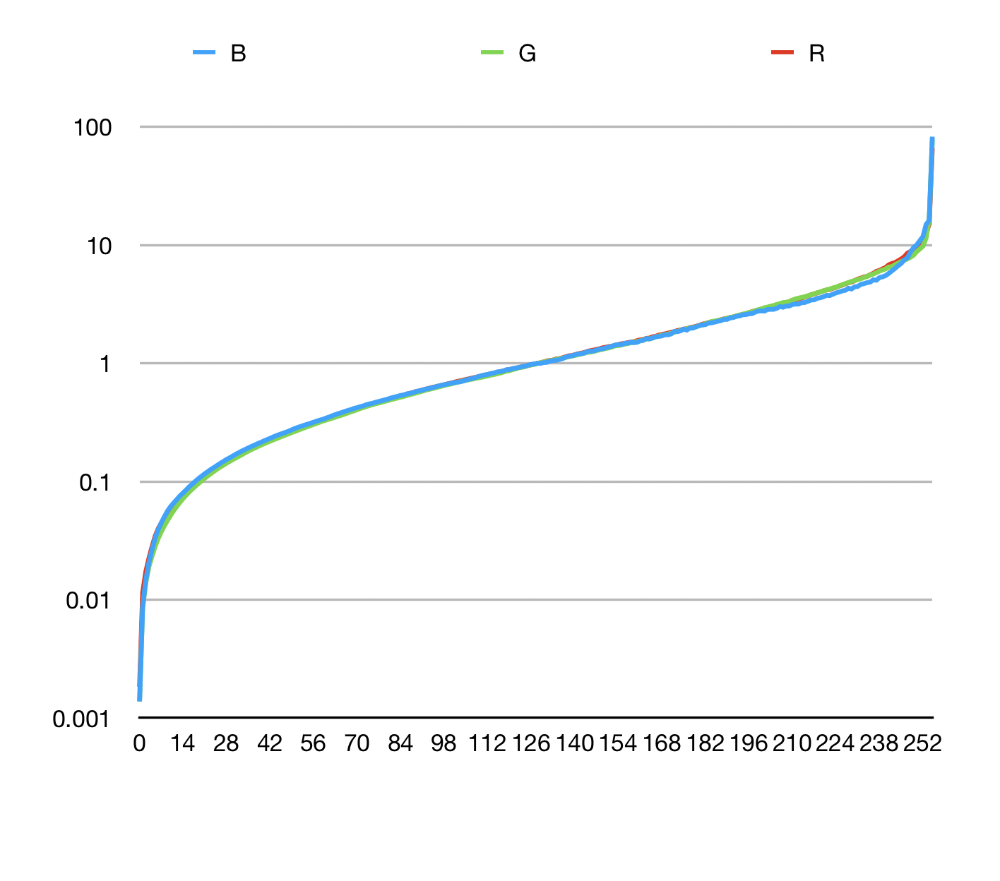

# Digital Visual Effects Project #1

## Members

- B04902064 李衡
- B04902085 何鎧至

## Alignment

## HDR

HDR 的部分我們用的是 Robertson 那篇的做法，因為這個算法需要算非常久(至少 8~10 次)才會開始 coverage，而遇到大圖的時候它跑一次就會需要很長的時間(大概一個小時)，如果要對三個 channel 都跑到 coverage 會花上數天。所以我們把原本拍的照片長跟寬都先縮小到 1/4，讓他對這張較小的圖片找出它的 G function(response function 的反函數)，再用這個 function 跑原本大圖來算出原圖的 Radius Map。G Function 的折線圖如下

可以發現在左右兩端的值是快速下降/上升的

## Tonemapping

這個部分我們使用的是外部程式來跑 Tone Mapping，結果如下

## File Info

- python
  - main.py: main file for this project, can use <code>python3 main.py -h</code> for help
  - Robertson.py: Implement of Robertson HDR
  - align.py: Implement of alignment
- curve[0~3].txt: G function for images in img/[01~05] (generated by img/05-4)
- img/[01~05]: image files for project
- [01~05]RobwithCurve.[hdr/png]: result radiance map/Tone mapping files for [01~05]
- mdimg/: images for this markdown

## Program

### How to use

- <code>python3 main.py -h</code> for help
- <code>-a</code> for alignment, <code>-g</code> to import known G function
- <code>-o</code> to specify output file's name, default is hdrimage.hdr
- when it use without <code>-g</code>, it will output G function to curve0.txt, curve1.txt, curve2.txt
- ex: <code>python3 main.py -a 2 -g img/01</code> to use alignment with known G function, and images are in <code>img/01</code>
- images filename must be <code>a:b.jpg</code> to represent exposure time is a/b

### Require modules

- opencv from image IO
- numpy for math calculation
- argparse for arguments

## Reference

1. [Mark Robertson, Sean Borman, Robert Stevenson, Estimation-Theoretic Approach to Dynamic Range Enhancement using Multiple Exposures, Journal of Electronic Imaging 2003.][1]
2. [][2]

[1]:https://doi.org/10.1117/1.1557695
[2]:
